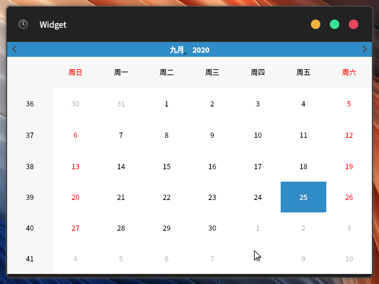
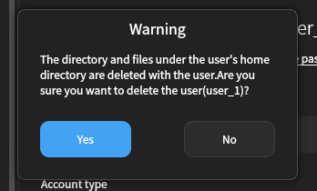
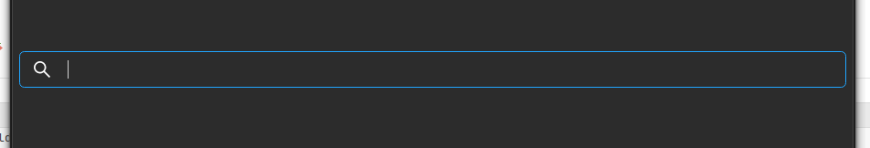
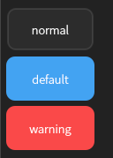
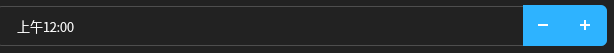
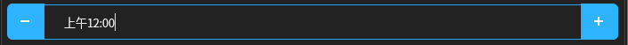
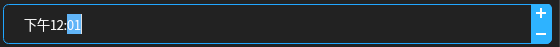
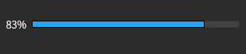

[TOC]

# kiranwidgets-qt5

kiran桌面环境的相关**Qt控件**的封装

## 编译

1.  安装编译依赖  
    `sudo yum install cmake gcc-c++ qt5-qtbase-devel qt5-linguist qt5-qtsvg-devel qt5-qtx11extras-devel libX11-devel xcb-util-devel gsettings-qt-devel`
2.  **源码根目录**下创建**build**目录`mkdir build`
3.  进行**build**目录,执行`cmake -DCMAKE_INSTALL_PREFIX=/usr ..`生成**Makefile**
4.  执行`make`进行编译

## 安装

1. 在**build**目录下执行`sudo make install`

## 卸载

1. 在**build**目录下执行`sudo make uninstall`

## 使用

1. 安装**examples**，查看`/usr/share/kiranwidgets-qt5/examples/`

## 具体控件的使用

### KiranApplication

为KiranDesktop所封装的QApplicaiton

加入了以下功能:

1. 基于Mate桌面的字体监控,监控org.mate.interface下font-nam应用程序字体和org.mate.Marco.general下titlebar-font的标题栏字体
2. 默认设置QtStyle为KiranStyle 

待加入功能:    

1. 感知系统主题变化，重新设置KiranStyle,以更新界面适应主题变化    

2. 感知系统缩放率调整，动态更新Qt程序的缩放率

#### 头文件位置

/usr/include/kiranwidgets-qt5/kiran-applicaiton.h  

#### 例子

略

### KiranSingleApplication

集成的Qt进程单例第三方代码，修改其基类为KiranApplicaiton

#### 头文件位置

/usr/include/kiranwidgets-qt5/kiran-single-application.h  

#### 例子

略

### kiran-titlebar-window

自定义标题栏窗口

#### 头文件位置

/usr/include/kiranwidgets-qt5/kiran-titlebar-window.h

#### 例子

##### KiranTitlebarWindow_UI

使用UI文件来生成界面的示例代码

###### 注意事项:

因为传入**setupUI**的参数为**KiranTitlebarWindow**创建的**QWidget**(专门用于显示窗口内容的区域 )，而不是**this**

- **不要**通过**QtDesigner信号和槽编辑器**添加的信号和槽

  QtDesigner中信号和槽编辑器中连接的信号和槽在生成代码setupUI方法中，会connect ui控件和KiranTitlebarWindow创建的QWidget的槽，因为传入setupUI的参数为KiranTitlebarWindow创建的子控件QWidget类型

- 尽量**不要**在QtDesigner**中通过右键控件“**Designer”来添加槽函数

  这个实际上是生成具有规范函数名的槽函数，在setupUI中的QMetaObject::connectSlotsByName(...);来进行连接，因为传入setupUI的参数为KiranTitlebarWindow创建的子控件QWidget类型，所以连接不上

##### KiranTitlebarWindow_CPP

使用代码来生成界面的示例代码

##### KiranTitlebarWindow_Simple

单纯使用面向过程,不通过派生来使用KiranTitlebarWindow

### KiranMessageBox

自定义消息对话框

#### 头文件位置

/usr/include/kiranwidgets-qt5/kiran-message-box.h

#### 例子

##### static_method 静态方法

使用静态方法，快速使用KiranMessageBox

##### instantiation 实例化使用

实例化定制按钮，使用KiranMessageBox

### KiranSearchBox

派生于**QLineEdit**,在**KiranStyle**中更改了其绘制

#### 头文件位置

/usr/include/kiranwidgets-qt5/kiran-search-box.h

#### 例子 

略

### KiranSwitchButton

派生于QAbstractButton,在KiranStyle中加入了SwitchButton的绘制

#### 头文件位置

/usr/include/kiranwidgets-qt5/kiran-switch-button.h

#### 例子

略

## Kiran Style

在**KiranApplicaiton**构造函数中，为了**统一样式**和**适应系统主题更新**，会设置默认**Style**为**KiranStyle**

有部分控件绘制的细节，可通过**/usr/include/kiranwidgets-qt5/style-property-helper.h**来控制KiranStyle的绘制细节

------

### QPushButton

**KiranStyle**中内置了三种绘制样式的Button(Normal,Default,Warning),可通过**style-property-helper.h**中的**getButtonType**/**setButtonType**方法获取和设置按钮的绘制样式

- **BUTTON_Normal**(默认值，默认将会以Normal绘制)
- **BUTTON_Default**
- **BUTTON_Warning**

------

### QSpinBox类型(QSpinBox,QTimeEdit,QDateEdit,QDateTimeEdit)

QSpinBox、QTimeEdit、QDateEdit、QDateTimeEdit KiranStyle中提供类似于SpinBox的控件按钮绘制位置四种选项

- **ARROW_HORIZONTAL_STACK **   水平堆叠

- **ARROW_TWO_SIDERS**   左右两边                  

  

- **ARROW_VERTICAL_STACK** 垂直堆叠

  

- **ARROW_POSITION_AUTOMATIC** 自动布局

  自动根据SpinBox的宽度来布局

  - 当宽度过小时,使用**ARROW_VERTICAL_STACK**布局
  - 当宽度过大时,使用**ARROW_HORIZONTAL_STACK**布局
  - 当宽度适中时,使用**ARROW_TWO_SIDERS**布局

  ------

### QProgressBar

**KiranStyle**给QProgressBar提供了三种进度条文本绘制选项

- **PROGRESS_TEXT_LEFT**        进度文本显示在左侧

- **PROGRESS_TEXT_CENTER**  进度文本显示在中间

- **PROGRESS_TEXT_RIGHT**     进度文本显示在右侧

